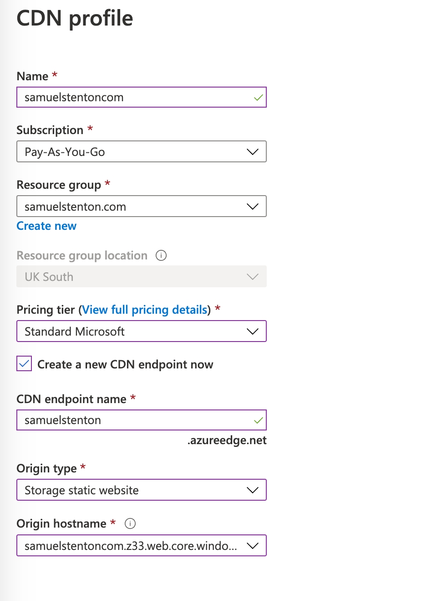
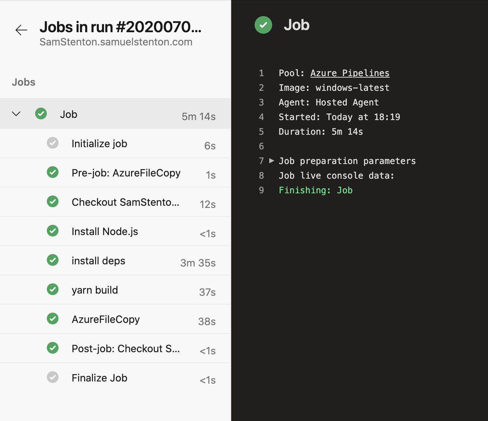

I've Been putting off rebooting the blog for quite some time. Renewing this domain for the third consecutive year without anything on it finaly gave me the push I needed to do something.

What better first post than one explaining how this very site is built and hosted. As my recent experience with Elanco has seen a strong use of Azure, it makes sense to build and host this site on there.

I'll be using the following services from Azure:

**Azure DevOps**

Will pull the site code from GitHub, run `gatsby build` and then send the output to Blob storage.

**Blob Storage**

Holds the static site files and allows acess to them from the a the internet.

**Content Delivery Network**

Adds a super fast content delivery backend but most importantly allows me to connect my personal domain to the site, Frustratingly the custom domain feature within Blob Storage only allows subdomains.

## Prerequisites

This post assumes that you have access to Azure, Azure DevOps and have created a Gatsby (or similar static site) site sitting in GitHub.

## Azure Setup

Here we'll setup the storage account, DevOps pipeline and CDN. I plan to eventually automate this setup using either ARM or Terraform. [Tweet at me](https://twitter.com/samuel_stenton) if you'd be interested in seeing this!

### Create Storage Account

On the Storage Account configuration screen you will be presented with the option to select your resource group (or create one); define the storage account names and select the various other controls. I just left the defaults skipping onto the review and create stage.


Once the storage account is created, you can search for 'static site' and enable the option. This will create a **\$web** container (remember this for later) and assign a Microsoft url accessable over http. Before saving you'll need to input the index and error document paths. If using Gatsby, this will be index.html and 404.html respectivly.


### Create the CDN and Connect a Domain

> You only need this step if you want to attach a root domain to your website. Azure storage will natively allow subdomains.

I want to attach a samuelstenton.com to the storage account, and so I'll need to make use of the Azure CDN. Obviously the added benefit of this is my site files will be globaly distrubuted across the Microsoft network.



Creating the CDN is a fairly simple process; give it a name, select the standard offering and connect the origin storage account we created earlier.

Once the provisioning process has completed, you should be able to navigate to the 'azureedge.net' url. It won't show anything at the moment as we've yet to push our code - that's coming up. First however we'll need to assign our custom domain; this is fairly easy and will require you to jump over to where ever you control your DNS. I'm using cloudflare so went ahead and added a CNAME for _samuelstenton.com_ mapped to the Azure CDN url we setup earlier, in my case this was _samuelstentoncom.azureedge.net_.


You might notice the 'proxied' note on the screenshot above. This means I'm making use of the Cloudflare network - this is essentially double CDNing, I've yet to workout if this causes issues but all looks good at the moment! The reasoning behind this is so I can enable free SSL (HTTPS) on the website.


As the origin server (Azure CDN) uses a well-known certificate, Cloudflare is able to provide full end-to-end encryption.

> If you're not using CloudFlare for DNS, Azure CDN will also provide free managed SSL certificates. I would recommend this over my double-stacked CDN solution.

## DevOps Pipeline

Here I've already linked DevOps to my GitHub repository and pushed my Gatsby site to it. All that is left is to make the final hop from repository to blob storage.

In order to automate the delivery of code to the blob storage, we'll setup a YAML pipeline. When code is pushed to the _master_ branch in GitHub the pipeline automatically picks it up, builds the site and copys the files over to Blob Storage.

```yaml
# Only trigger on master branch commits
trigger:
  - master

# AzureFileCopy is only available on windows
pool:
  vmImage: "windows-latest"

steps:
  - task: NodeTool@0
    inputs:
      versionSpec: "10.x"
    displayName: "Install Node.js"

  - script: yarn
    displayName: "install deps"

  - script: yarn build
    displayName: "yarn build"

  - task: AzureFileCopy@3
    inputs:
      SourcePath: "$(System.DefaultWorkingDirectory)/public"
      azureSubscription: $(AZURE_SUBSCRIPTION)
      Destination: "AzureBlob"
      storage: $(STORAGE_ACCOUNT)
      ContainerName: "$web"
```

Notice I made use of `$(AZURE_SUBSCRIPTION)` and `$(STORAGE_ACCOUNT)`; these are variables within ADO YAML pipelines. You can set them up to allow for some secrets to be output into your pipeline before being executed. This is useful for when you want to publish your code publicly and not share connection details or API keys.


Once you're ready, click save; this will push your yaml file to your GitHub account and kick off a brand new build.



when your build completes, your site has been pushed! Go checkout your freshly deployed website!
